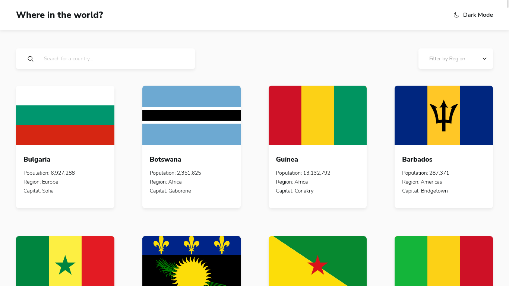

# Frontend Mentor - REST Countries API with color theme switcher solution

This is a solution to the [REST Countries API with color theme switcher challenge on Frontend Mentor](https://www.frontendmentor.io/challenges/rest-countries-api-with-color-theme-switcher-5cacc469fec04111f7b848ca). Frontend Mentor challenges help you improve your coding skills by building realistic projects.

## Table of contents

- [Overview](#overview)
  - [The challenge](#the-challenge)
  - [Screenshot](#screenshot)
  - [Links](#links)
- [My process](#my-process)
  - [Built with](#built-with)
  - [What I learned](#what-i-learned)
  - [Useful resources](#useful-resources)
- [Author](#author)

## Overview

### The challenge

Users should be able to:

- See all countries from the API on the homepage
- Search for a country using an `input` field
- Filter countries by region
- Click on a country to see more detailed information on a separate page
- Click through to the border countries on the detail page
- Toggle the color scheme between light and dark mode _(optional)_

### Screenshot

### Links

- Solution URL: [Frontend Mentor](https://your-solution-url.com)
- Live Site URL: [Vercel](https://your-live-site-url.com)

## My process

### Built with

- Semantic HTML5 markup
- CSS custom properties
- Flexbox
- CSS Grid
- Mobile-first workflow
- [React](https://reactjs.org/) - JS library
- [Styled Components](https://styled-components.com/) - For styles
- [React Router](https://reactrouter.com/en/main) - For game flow
- [Vite](https://vitejs.dev/) - For project creation

### What I learned

In this challenge I tested some react-router v6.4 features like `loader`, I also had a more in-depth practice with CSS Grid, CSS custom properties, and created a couple of custom React Hooks.

### Useful resources

- [Easy Dark Mode (and Multiple Color Themes!) in React](https://css-tricks.com/easy-dark-mode-and-multiple-color-themes-in-react/) - Simple tutorial for apply themes in react
- [React Router Tutorial](https://reactrouter.com/en/main/start/tutorial) - Tutorial for the latest features.
- [Pure CSS Select](https://codepen.io/raubaca/pen/bGWmZje) - A Codepen by myself about styling `select` without a wrapper

## Author

- LinkedIn - [Raúl Barrera Castiblanco](https://www.linkedin.com/in/raubaca/)
- Frontend Mentor - [@raubaca](https://www.frontendmentor.io/profile/raubaca)
- Twitter - [@raubaca](https://www.twitter.com/raubaca)
- CodePen [Raúl Barrera](https://codepen.io/raubaca)
